# Descripcion
Este es el segundo trabajo práctico de Laboratorio IV de la Tecnicatura Universitaria en Programación dictada en la UTN FRA. El proyecto está realizado con Angular y Firebase y consiste en administrar una clínica online, con usuarios de roles: paciente, especialista o administradores.

## Bienvenida
Esta pagina muestra las caracteristicas generales de la clinica.
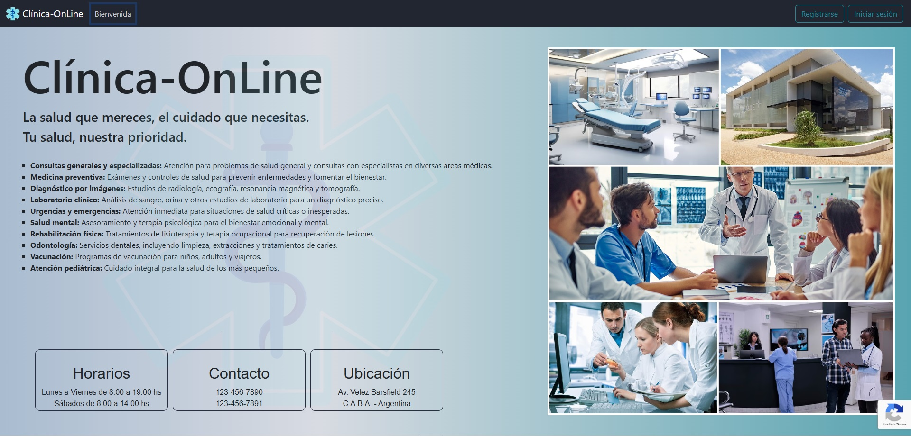

## Login
Para entrar en la aplicación, el usuario tiene que loguearse con su correo electronico y su contraseña. Si todavía, no esta registrado en el sistma, puede hacerlo entrando en "Registrarse" en la barra de navegación.

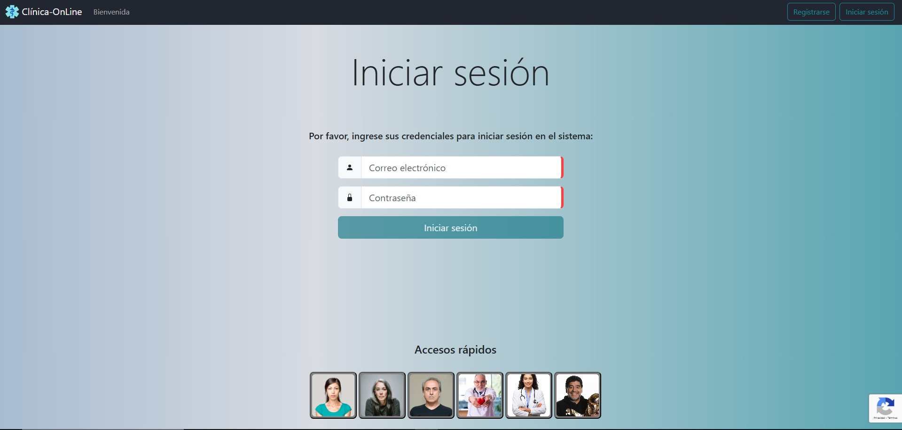

## Registro
Hay 3 tipos de roles para los usuarios: paciente, especialista, o administrador.
Como usuario común si no está registrado, puede realizarlo como: paciente o especialista. Si desea ser administrador, otro administrador ya registrado anteriormente, tiene la potestad de registrarlo.
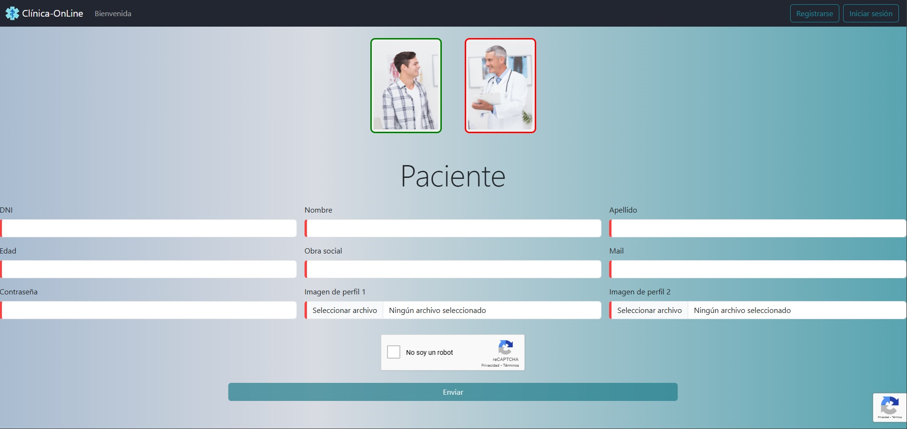

## Solicitar Turno
Como usuario paciente puede solicitar un turno. También lo puede realizar un administrador para un paciente. La solicituda del turno se realiza en forma secuencial: primero tiene que seleccionar un especialista, luego la especilaidad, fecha y horario.
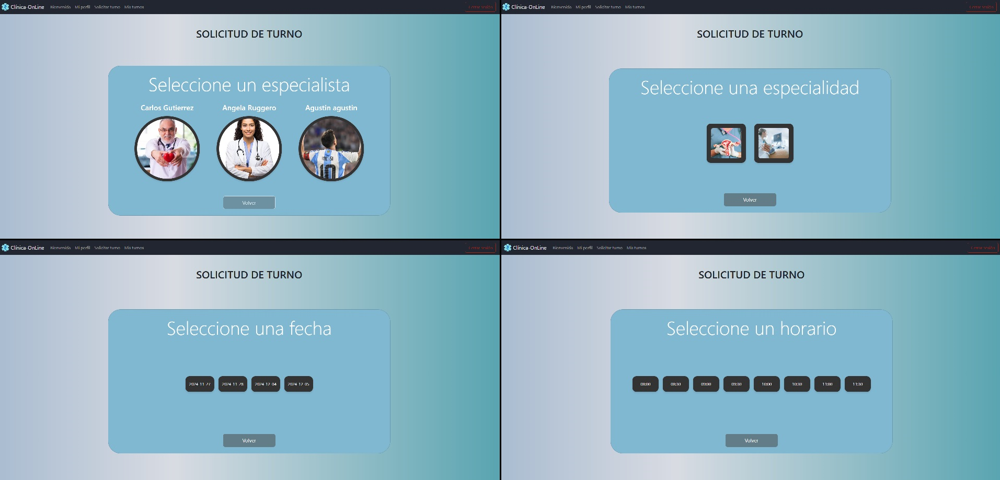

## Mi Perfil
En mi perfil voy a encontrar los datos propios del usuarios y algunas acciones que puede realizar según su rol.
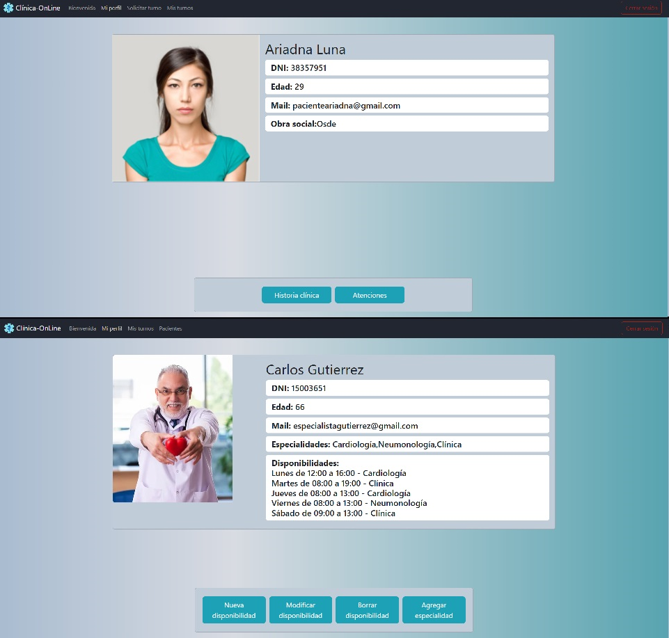

# Pacientes

## Mis turnos
Como paciente o especialista puede visualizar los turnos y sus caracteristicas. Los turnos se pueden filtrar por especialidad, especialista, por algun valor que contengan los turnos, ya sea por campo dinamico o no.
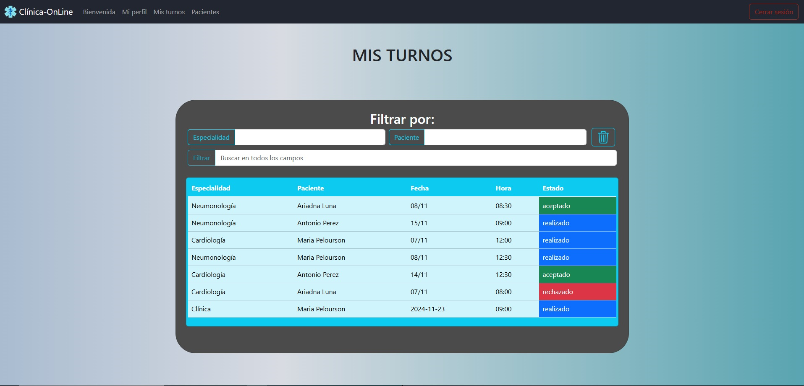

## Historia Clinica
Como paciente puede visualizar la historia clinica si es que posee alguna. Tambien puede descargarla como PDF.
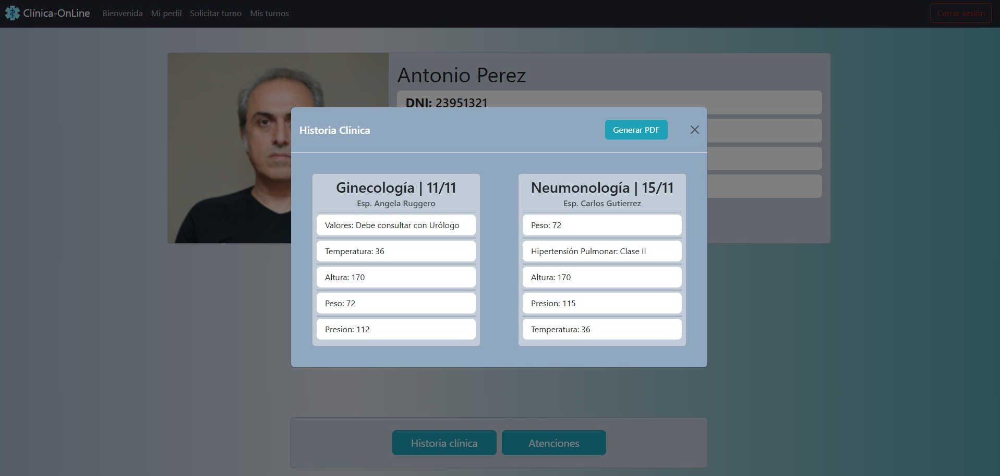

# Especilista

## Pacientes
A este componente solo pueden acceder los especialistas. Y allí pueden encontrar sólo los pacientes que hayan atendido al mendo una vez. Clickeando en alguno de ellos, se puede visualizar los datos de cada turno.
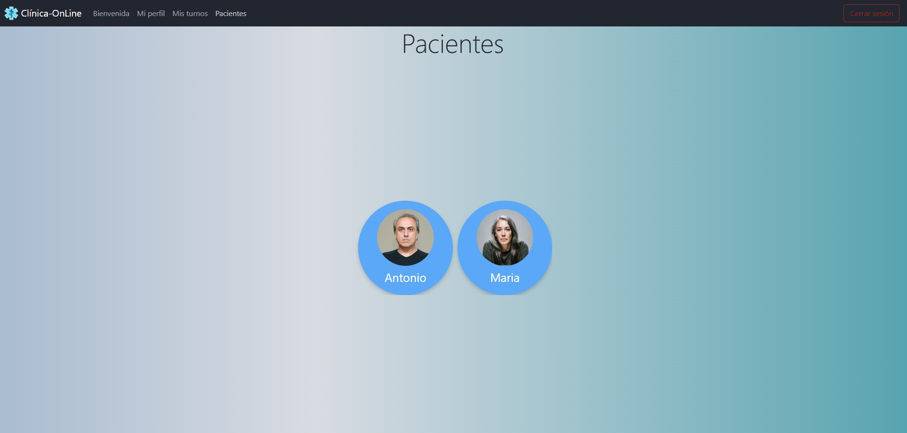
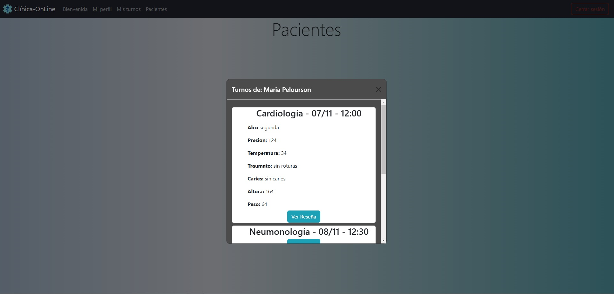

# Administrador

## Usuarios
Como administrador puede visualizar todos los usuarios. Clickeando en alguno de los pacientes, puede visualizar los datos del mismo. Clickeando en un especialista, puede aprobar o desaprobar al mismo.
Puede registrar a cualquier tipo de usuarios.
Puede descargar un Excel con la lista de pacientes, especialistas y administradores.

## Usuarios
Como administrador puede visualizar todos los turnos.
Puede filtrar por especialidad o especialista. 
Clickeando en los turnos, podrá realizar la acción correspondiente permitida.
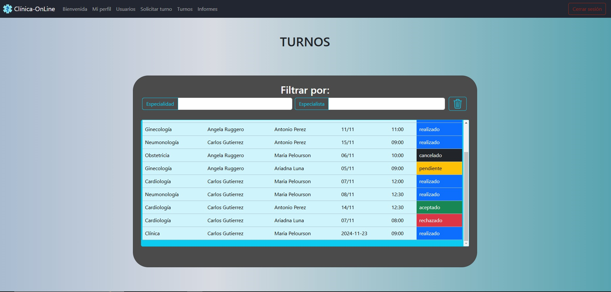

## Informes
Como administrador puede visualizar todos los informes.
Debe elegir el informe para visualizar el mimo. 
Tambien puede descargarlo en PDF
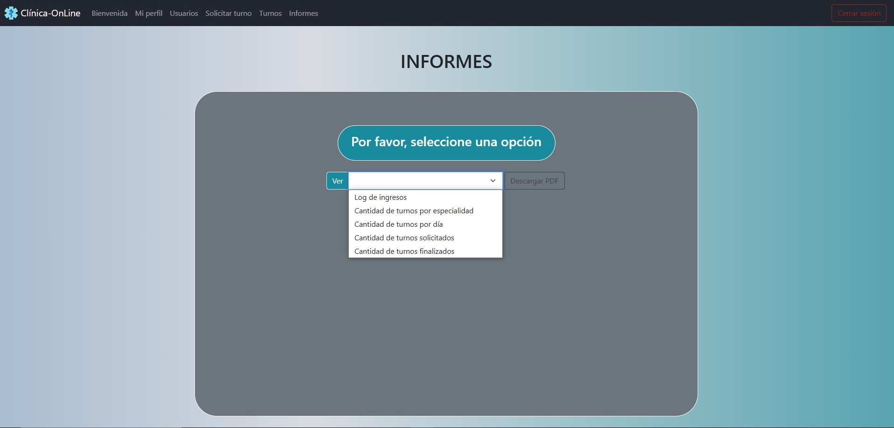
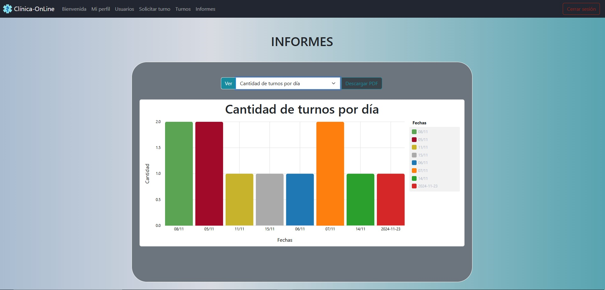

